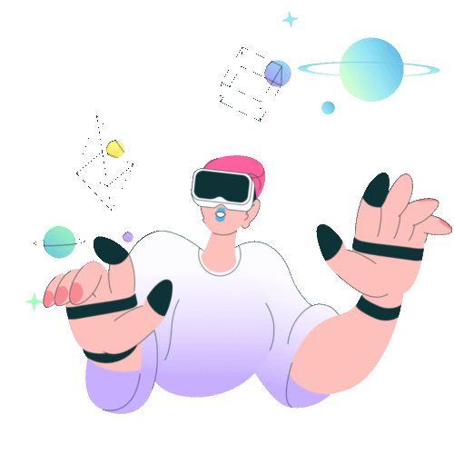

<h1>
  Hey there!, I'm Om Khulbe
  
</h1>

  

---

### :man_technologist: About :
- :telescope: I’m a student currently enrolled at Institute of Forensic Science, Mumbai.

- :seedling: Exploring Backend Technologies and Python Librarires.

- :zap: In my free time, I work on my personal projects and play games.

- :mailbox: How to reach me: 

- :zap: Funt Fact: My coding skills are so good, they're practically cheat codes (but shhh:shushing_face:, don't tell Rockstar).

---

### :hammer_and_wrench: Languages and Tools :

  &nbsp;
  &nbsp;
  &nbsp;
  &nbsp;
  &nbsp;
  &nbsp;
  &nbsp;
  &nbsp;
  &nbsp;
  &nbsp;
  &nbsp;
  &nbsp;
  &nbsp;
  &nbsp;
  &nbsp;
  &nbsp;
  &nbsp;

---

### :fire: My Stats :

---

### Support :

---

### Connect :
 

  

  
  

    

